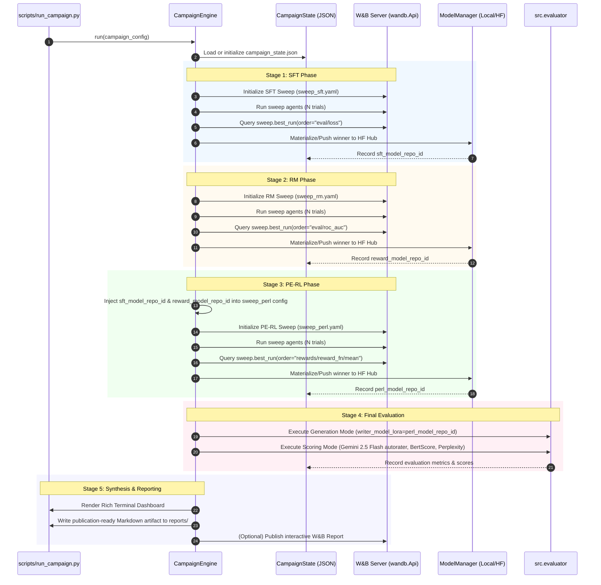

# Auto-PERL: Automated Scientific Campaign Orchestrator
## Architectural Design & Implementation Plan

> **Status**: Planning & Design Phase  
> **Target Module**: `src/orchestrator/`  
> **CLI Entrypoint**: `scripts/run_campaign.py`  
> **Key Philosophy**: Modular, Zero-Lockin, W&B-Native, Fully Resumable (*sem gambiarra*).

---

## 1. Executive Summary & Inspiration

The goal of this orchestrator is to automate the full scientific lifecycle of Parameter-Efficient Reinforcement Learning (PE-RL) experiments:
1. **SFT Sweep** $\to$ automated best checkpoint selection.
2. **Reward Model (RM) Sweep** $\to$ automated best checkpoint selection.
3. **PE-RL (RLOO) Sweep** $\to$ dynamic injection of chosen SFT & RM checkpoints $\to$ automated best policy selection.
4. **Final Evaluation** $\to$ automated completion generation and multi-metric scoring (Gemini 2.5 Flash autorater, BertScore, Perplexity).
5. **Intelligible & Stylish Reporting** $\to$ automated publication-ready Markdown report, terminal dashboard, and W&B Report generation.

### Industry Platform Inspiration
Our design borrows proven architectural patterns from modern orchestration platforms while keeping the codebase lightweight, Python-native, and zero-lockin:

* **Prefect / Dagster (Asset-Oriented State & DAG Execution)**:
  * Each stage produces a concrete, verified **Asset** (e.g., SFT Checkpoint Repo ID, RM Checkpoint Repo ID, PE-RL Policy Repo ID, Evaluation Metric Summary).
  * Explicit state transitions (`PENDING` $\to$ `RUNNING` $\to$ `COMPLETED` / `FAILED`).
  * Parameter passing occurs via an immutable, serializable `CampaignContext`.
* **Ray Tune (Smart Checkpoint Retention & Eviction)**:
  * Eliminates the wasteful "retrain-from-scratch" step by managing checkpoints intelligently: save top-1 locally during sweeps, evict inferior runs, and push the winner to Hugging Face Hub immediately upon sweep completion.
* **Weights & Biases SDK (`wandb.Api` & `wandb-workspaces`)**:
  * Programmatic sweep creation, agent launching, metric monitoring, and best-run query via `sweep.best_run()`.
  * Dynamic hyperparameter extraction (`best_run.config`) and automatic W&B Report publishing.
* **Metaflow (Zero-Lockin Modularity)**:
  * The orchestrator resides exclusively in `src/orchestrator/` and calls existing scripts (`src/writer_sft.py`, `src/reward_model.py`, `src/perl.py`, `src/evaluator.py`) without modifying a single line of existing core code.
  * If the orchestrator is removed in the future, the repository remains 100% functional with manual scripts.

---

## 2. Core Architecture & Component Hierarchy

```
google3/experimental/users/leobianco/new_perl/
├── src/
│   └── orchestrator/                 # Completely self-contained package
│       ├── __init__.py
│       ├── config.py                 # Dataclasses: CampaignConfig, SweepStageConfig, EvalConfig
│       ├── state.py                  # State persistence (campaign_state.json), recovery & resumption
│       ├── sweep_controller.py       # W&B Sweep lifecycle manager (create, agent, monitor, best_run)
│       ├── model_manager.py          # Local checkpoint retention/eviction & Hugging Face Hub push
│       ├── reporter.py               # Scientific report generator (Markdown, Rich CLI, W&B Report)
│       ├── stages/
│       │   ├── __init__.py
│       │   ├── base.py               # Abstract BaseStage interface
│       │   ├── sft_stage.py          # SFT Sweep & Best Model Materialization
│       │   ├── rm_stage.py           # RM Sweep & Best Model Materialization
│       │   ├── perl_stage.py         # PE-RL Sweep (with dynamic SFT/RM injection)
│       │   └── eval_stage.py         # Test generation & Gemini Autorater scoring
│       └── engine.py                 # CampaignEngine (orchestrates the DAG)
│
├── scripts/
│   └── run_campaign.py               # CLI tool to launch/resume an automated campaign
│
└── reports/                          # Auto-generated campaign summaries (.md, .json)
```

---

## 3. Detailed Workflow & Data Flow



---

## 4. Key Technical Decisions & Solutions to Current Pain Points

### 4.1. Solving the "Retraining the Winner" Problem
**Current issue**: Sweeps use `--save_strategy=no` to avoid saving 20-50 models to disk. Afterwards, the chosen run must be re-trained from scratch via bash just to push it to Hugging Face.

**Solution: Dual-Mode Model Management**:
1. **Mode A: Smart Local Eviction (Zero Retraining)**:
   - Configure sweep runs to save locally to a temporary folder (`--save_strategy=epoch --save_total_limit=1 --output_dir=./tmp_checkpoints/<run_id>`).
   - The orchestrator monitors runs. When a trial completes, if its metric is worse than the current best, its checkpoint directory is automatically deleted (`shutil.rmtree`).
   - When the sweep finishes, only the winning checkpoint remains on disk!
   - The orchestrator uploads this checkpoint folder directly to Hugging Face Hub via `huggingface_hub.HfApi().upload_folder(...)`.
   - **Time Saved**: 100% of the retraining time.
2. **Mode B: Automated Re-Run Materialization (Zero Human Intervention)**:
   - If local disk is strictly constrained (e.g., multi-GPU parallel sweeps), keep `--save_strategy=no`.
   - The orchestrator automatically fetches `best_run.config`, constructs the CLI command for the training script with `--push_to_hub True`, executes it, blocks until complete, and captures the uploaded repo ID.

### 4.2. State Persistence & Crash Resumption
- A `campaign_state.json` file records:
  ```json
  {
    "campaign_id": "npov_20260914_1500",
    "task_name": "npov",
    "status": "IN_PROGRESS",
    "current_stage": "perl",
    "stages": {
      "sft": {
        "status": "COMPLETED",
        "sweep_id": "leobianco/new_perl_sft/abc1234",
        "best_run_id": "run_01",
        "best_metric": 0.312,
        "best_params": {"learning_rate": 0.003, "lora_r": 8},
        "model_repo_id": "leobianco/npov_SFT_gemma-4-E2B-it_..."
      },
      "rm": { ... },
      "perl": { ... },
      "eval": { ... }
    }
  }
  ```
- If a machine crashes or a sweep is preempted, running `python -m scripts.run_campaign --resume` instantly skips completed stages and picks up exactly where it left off.

### 4.3. Dynamic Dependency Injection
- In Stage 3 (PE-RL), `sft_model_path` and `reward_model_path` must point to the outputs of Stages 1 & 2.
- The orchestrator dynamically loads the base YAML (`scripts/sweep_perl.yaml`), injects:
  `--sft_model_path=<sft_repo_id>` and `--reward_model_path=<rm_repo_id>`
  directly into the in-memory command dictionary before calling `wandb.sweep(...)`. No manual file editing required.

### 4.4. "Stylish & Intelligible" Reporting Engine
The reporting engine consolidates the entire campaign into three formats:
1. **Rich Terminal Scorecard**: Clean CLI table displaying stages, durations, winning hyperparams, and delta metrics.
2. **Markdown Scientific Brief** (`reports/<campaign_id>_summary.md`):
   - Executive Summary (Task, Base Model, Date, Git Commit).
   - Comparison Table: Base Model vs. SFT vs. PE-RL on Hallucination Rate, Win Rate, BertScore, Perplexity.
   - SFT & RM Hyperparameter Analysis (winning learning rate, LoRA rank/alpha, epochs).
   - Direct clickable links to Hugging Face checkpoints and W&B sweep boards.
3. **Interactive W&B Report** (via `wandb-workspaces` / Reports API):
   - Parallel coordinate plots showing hyperparameter influence.
   - Reward convergence and KL divergence curves.

### 4.5. Programmatic Sweep Termination & Bounds (`max_runs`)
**Current issue**: W&B sweeps configured with Bayesian optimization or random search run indefinitely by default; the W&B backend continues generating new parameter proposals forever until manually killed.

**Solution: Two-Tiered Programmatic Termination**:
1. **Agent-Level Bound (`count=max_runs`)**:
   - Each stage configuration accepts a user-defined `max_runs` parameter, configured with these project defaults:
     - **SFT (`sft_max_runs`)**: `30`
     - **Reward Model (`rm_max_runs`)**: `30`
     - **PE-RL (`perl_max_runs`)**: `10`
   - When launching the agent process, the orchestrator explicitly passes `count=max_runs` (e.g., `wandb agent --count <N> <sweep_id>` or `wandb.agent(sweep_id, count=N)`). The agent process automatically terminates after completing exactly $N$ runs.
2. **Sweep-Level Closure (`wandb sweep --stop`)**:
   - After the agent completes its allotted runs (or if a timeout threshold is exceeded), the orchestrator explicitly closes the sweep on the W&B backend using `wandb.Api().sweep(...).stop()` and CLI fallback (`wandb sweep --stop <sweep_id>`).
   - This transitions the sweep state from `RUNNING` to `STOPPED`/`COMPLETED`, preventing rogue agents or lingering cloud queues from spawning further trials.
3. **Timeout Watchdog**:
   - A configurable `timeout_minutes` per stage prevents silent hangs (e.g., NCCL deadlocks or GPU OOM loops) from stalling the entire campaign indefinitely.

---

## 5. Implementation Checklist

### Phase 1: Core Configuration & State Management
- [X] **1.1** Create `src/orchestrator/__init__.py`.
- [X] **1.2** Implement `src/orchestrator/config.py`:
  - Dataclasses for `StageConfig`, `SweepConfig` (with `max_runs` defaults: SFT=30, RM=30, PE-RL=10, and `timeout_minutes`), `EvalConfig`, `ReportingConfig`, and `CampaignConfig`.
  - YAML serialization and deserialization helpers.
  - Default configurations tailored for `npov`, `bosch`, `ragtruth`, `ragtruth-qa`, and `ragtruth-summarization`.
- [X] **1.3** Implement `src/orchestrator/state.py`:
  - `CampaignState` class handling state serialization to/from `campaign_state.json`.
  - Atomicity guarantee (atomic write via tempfile to prevent corruption on sudden kill).
  - Resumption logic (`get_next_pending_stage()`).

### Phase 2: W&B Sweep & Agent Controller (with Automatic Termination)
- [X] **2.1** Implement `src/orchestrator/sweep_controller.py`:
  - `create_sweep(sweep_dict, project, entity)` wrapper around `wandb.sweep`.
  - `run_sweep_agent(sweep_id, max_runs, timeout_minutes, project, entity)` enforcing strict run counts via `count=max_runs`.
  - `stop_sweep(sweep_id, entity, project)` to programmatically close the sweep on W&B (`sweep.stop()` / `wandb sweep --stop`).
  - `fetch_best_run(sweep_id, metric_name, goal)` using `wandb.Api()` to safely retrieve the optimal run and its hyperparameters.
  - Timeout and exception watchdog to ensure `stop_sweep` is called even on failure.

### Phase 3: Model & Checkpoint Management
- [X] **2.2** Implement `src/orchestrator/model_manager.py`:
  - `materialize_model(...)`: Subprocess runner to execute the training script with winning parameters and `--push_to_hub True`.
  - `upload_local_checkpoint(...)`: Direct Hugging Face Hub upload via `huggingface_hub.HfApi().upload_folder(...)`.
  - `prune_inferior_checkpoints(...)`: Local disk eviction handler to delete losing sweep runs.
  - Verification check: Validate that the uploaded model exists on Hugging Face Hub before proceeding to downstream stages.

### Phase 4: Stage Implementations
- [X] **3.1** Implement `src/orchestrator/stages/base.py`:
  - Abstract base class `BaseStage` with `execute(context, state) -> StageResult`.
- [X] **3.2** Implement `src/orchestrator/stages/sft_stage.py`:
  - Configures and launches SFT sweep (`scripts/sweep_sft.yaml`).
  - Optimizes `eval/loss` (minimize).
  - Materializes and records `sft_model_repo_id`.
- [X] **3.3** Implement `src/orchestrator/stages/rm_stage.py`:
  - Configures and launches RM sweep (`scripts/sweep_rm.yaml`).
  - Optimizes `eval/roc_auc` (maximize).
  - Materializes and records `reward_model_repo_id`.
- [X] **3.4** Implement `src/orchestrator/stages/perl_stage.py`:
  - Injects `sft_model_repo_id` and `reward_model_repo_id` into `scripts/sweep_perl.yaml`.
  - Configures and launches PE-RL sweep.
  - Optimizes `rewards/reward_fn/mean` (maximize).
  - Materializes and records `perl_model_repo_id`.
- [X] **3.5** Implement `src/orchestrator/stages/eval_stage.py`:
  - Dispatches `src.evaluator` in `generate` mode using the final PE-RL model.
  - Dispatches `src.evaluator` in `score` mode with Gemini 2.5 Flash autorater, BertScore, and Perplexity.
  - Extracts and structures evaluation metrics into a standardized dictionary.

### Phase 5: Scientific Reporting Engine
- [X] **4.1** Implement `src/orchestrator/reporter.py`:
  - `generate_markdown_report(...)`: Builds a stylish GitHub-flavored markdown report with summary tables and key scientific findings.
  - `render_console_dashboard(...)`: Displays a Rich-formatted scorecard in the terminal.
  - `publish_wandb_report(...)`: Generates an interactive W&B Report if `wandb-workspaces` is installed; falls back gracefully to logging summary metrics.

### Phase 6: Orchestration Engine, Interactive TUI & CLI Entrypoint
- [X] **5.1** Implement `src/orchestrator/engine.py`:
  - Coordinates the linear DAG execution.
  - Handles stage lifecycle transitions, error catching, retries, and clean state updates.
- [X] **5.2** Implement `src/orchestrator/cli/wizard.py`:
  - Interactive questionnaire wizard using `questionary` for guided task, stage, budget, and hyperparameter configuration.
- [X] **5.3** Implement `src/orchestrator/cli/tui.py`:
  - Live "Mission Control" terminal UI using `textual` / `rich` optimized for `tmux`.
  - Real-time leaderboard, DAG progress bars, live log streaming, and interactive hotkeys (`[A] Advance`, `[P] Pause`, `[S] Stop`, `[I] Inspect`).
- [X] **5.4** Implement `scripts/run_campaign.py`:
  - Unified CLI entrypoint using `typer` with subcommands: `run`, `wizard`, `status`, `resume`, `report`.
  - Flags: `--task`, `--stages`, `--sft-runs`, `--rm-runs`, `--perl-runs`, `--dry-run`, `--no-tui`.

### Phase 7: Verification & Testing
- [X] **6.1** Unit tests in `src/orchestrator/tests/`:
  - Test config parsing and dynamic argument injection.
  - Test state persistence and atomic recovery.
  - Test mock sweep execution and best-run parameter extraction.
- [X] **6.2** Dry-run end-to-end integration test:
  - Run `python3 scripts/run_campaign.py --task npov --dry-run` to verify full DAG chaining and reporting without GPU allocation.

---

## 6. Safety & Rollback Guarantee

To guarantee that this library is strictly non-invasive:
1. **Zero modifications to existing core code**:
   - `src/writer_sft.py`, `src/reward_model.py`, `src/perl.py`, `src/pipelines.py`, and `src/evaluator.py` remain untouched.
   - All existing bash scripts (`scripts/*.sh`) continue to work exactly as before.
2. **Easy Removal**:
   - If the user decides to discontinue use of the orchestrator in the future, simply running:
     ```bash
     rm -rf src/orchestrator scripts/run_campaign.py ORCHESTRATOR_IMPLEMENTATION.md
     ```
     will cleanly restore the repository to its exact prior state with zero residue or broken dependencies.

---

## 7. User Interaction Interface & Configuration Model

How does the user interact with, configure, and control the orchestrator?  
The system provides two complementary interfaces: a **Declarative YAML Config** for reproducibility and a **Ergonomic CLI** for rapid experimentation.

### 7.1. Declarative Campaign Config (`configs/campaign_<task>.yaml`)
A single, human-readable file configuring the entire scientific campaign:

```yaml
# ==============================================================================
# Auto-PERL Campaign Configuration
# ==============================================================================
campaign:
  name: "npov_alignment_v1"
  task: "npov"                       # npov, bosch, ragtruth, etc.
  seed: 130104
  user: "leobianco"
  project: "new_perl"

# Stages to execute in order (can omit stages to run partial pipelines)
stages:
  - sft
  - rm
  - perl
  - eval

sft_stage:
  enabled: true
  sweep_config: "scripts/sweep_sft.yaml"
  max_runs: 30                       # Auto-stop after 30 trials
  metric: "eval/loss"
  goal: "minimize"
  # Optional: override parameter search grid without modifying sweep_sft.yaml
  parameter_overrides:
    num_train_epochs: [1, 2]
    learning_rate:
      min: 0.0001
      max: 0.003

rm_stage:
  enabled: true
  sweep_config: "scripts/sweep_rm.yaml"
  max_runs: 30                       # Auto-stop after 30 trials
  metric: "eval/roc_auc"
  goal: "maximize"

perl_stage:
  enabled: true
  sweep_config: "scripts/sweep_perl.yaml"
  max_runs: 10                       # Auto-stop after 10 trials
  metric: "rewards/reward_fn/mean"
  goal: "maximize"
  # Model paths: "auto" pipes from SFT/RM stages above.
  # Can also be set to an existing HuggingFace repo ID to skip SFT or RM!
  sft_model_path: "auto"
  reward_model_path: "auto"

eval_stage:
  enabled: true
  evaluator_model: "gemini-2.5-flash"
  max_eval_samples: 1000
  compute_bertscore: true
  compute_perplexity: true

reporting:
  generate_markdown: true            # Saves to reports/<campaign_name>_summary.md
  publish_wandb_report: true         # Generates interactive W&B report URL
```

### 7.2. Python Packages for the Interactive Experience

**Decision (revised during implementation):** the original plan called for
`textual` + `typer`. Both were dropped. What actually shipped:

| Package | Role in Auto-PERL | Why |
| :--- | :--- | :--- |
| **`rich`** | Pinned live dashboard, tables, panels, scorecards | Renders a *pinned block* via `rich.live.Live(screen=False)`, so log lines scroll into the normal tmux scrollback instead of being swallowed. Handles resize, and degrades to plain text when piped. |
| **`questionary`** | Interactive setup wizard | Arrow-key select menus, multi-select checkboxes, and inline validation. Optional: a numbered-menu `PlainPrompter` fallback is used when it is absent. |
| *(stdlib)* **`argparse`** | CLI command framework | No third-party dependency, no shell-completion machinery we do not use, and trivially testable: `app.main(argv, console=...)` is called directly by the unit tests. |

Add to `requirements.in`:
```text
rich
questionary
```

#### Why not `textual`?
A full-screen alternate-buffer TUI is actively *wrong* for this workload:

* It takes over the alternate screen buffer, which **destroys tmux scrollback
  and copy-mode** (`Ctrl-b [`) — exactly what you need when a sweep fails at
  3 a.m. and you want to read 200 lines back.
* Re-attaching a tmux session or resizing a pane repaints a full-screen app
  badly; a pinned block simply re-flows.
* It cannot be piped. `nohup ... > campaign.log` would capture escape-sequence
  garbage instead of logs.
* It needs an async event loop, which fights the synchronous, blocking
  `wandb agent` subprocess the engine already drives.

The shipped design gets the same information density with none of those costs:
a docker-compose style **pinned status block at the bottom** (header, DAG, live
leaderboard, hotkeys) with **logs streaming above it**.

#### Degradation matrix
Every surface has exactly one code path that adapts, verified by tests:

| Condition | Behaviour |
| :--- | :--- |
| `rich` not installed | Plain-text renderer; identical information, no styling. |
| `NO_COLOR` / not a TTY / `TERM=dumb` | Colors off, markup stripped. |
| Non-UTF-8 encoding or `--ascii` / `PERL_ASCII=1` | ASCII glyph set. |
| Narrow pane (< ~100 cols) | Artifact column and verbose hotkey labels collapse. |
| stdin not a TTY (`nohup`, CI) | Hotkeys disabled with a notice; run continues unattended. |

---

### 7.3. Interactive Setup Wizard (`src/orchestrator/cli/wizard.py`)
When launched via `python3 scripts/run_campaign.py wizard` (or `run -i`), the
user is greeted with a guided terminal wizard:

```text
? Which task do you want to optimize?
  ❯ npov                     Neutral Point of View rewriting (Wikipedia NPOV edits)
    bosch                    Factuality / hallucination reduction on Bosch reports
    ragtruth                 RAG factuality benchmark (all sub-tasks)

? Which stages should this campaign run?
  ❯ [X] SFT sweep             Supervised fine-tuning of the writer policy
    [X] Reward model sweep    Trains the preference/reward model
    [X] PE-RL sweep           RLOO policy optimization with LoRA adapters
    [X] Final evaluation      Gemini autorater + BertScore + perplexity

? Pick a trial budget preset:
    smoke      1/1/1 trials, 20 eval samples - wiring check (minutes)
    quick      5/5/3 trials, 200 eval samples - fast signal (a few hours)
  ❯ standard   30/30/10 trials, 1000 eval samples - project default
    thorough   60/60/20 trials, 2000 eval samples - publication run
    custom     Pick the trial budget for each stage by hand

? Dry-run first (simulate the whole DAG, no GPU work)? [y/N]
```

It then prints a **review panel** (task, budgets, checkpoints, seed, estimated
wall-clock time, state file), the **equivalent non-interactive command** so the
run is reproducible from a script, and offers to save the config to `configs/`.

Design notes:
* The wizard is split into a `Prompter` abstraction, pure helpers
  (`build_config`, `estimate_runtime`, `equivalent_command`) and the flow, so
  the whole conversation is unit tested via a `ScriptedPrompter`.
* Stage selection is canonicalized to pipeline order, so checking the boxes out
  of order cannot produce a campaign that runs PE-RL before SFT.
* Selecting PE-RL without SFT/RM forces you to supply the upstream checkpoints,
  validated on the spot.

---

### 7.4. Live "Mission Control" Dashboard (`src/orchestrator/cli/dashboard.py`)
Logs stream normally; the block below stays pinned at the bottom of the pane:

```text
14:02:11 PERL  Trial 4/10 started (lr=8e-5, beta=0.05)
14:02:19 PERL  rewards/reward_fn/mean: 3.10
╭─ Auto-PERL ── npov · gemma-4-E2B-it · 1h 24m ── IN_PROGRESS ── DRY-RUN ──────╮
╰──────────────────────────────────────────────────────────────────────────────╯
  ✔  SFT Sweep           ████████████████████  30/30  eval/loss   0.3120  12m
  ✔  Reward Model Sweep  ████████████████████  30/30  roc_auc     0.9610  31m
  ▶  PE-RL Sweep         ████████░░░░░░░░░░░░   4/10  reward/mean 3.4200  18m
  ·  Final Evaluation    ░░░░░░░░░░░░░░░░░░░░      -  halluc.rate      -   -
╭─ Live leaderboard • PE-RL Sweep ─────────────────────────────────────────────╮
│  #  Run       Metric   Params                                    State       │
│  1★ def456    3.4200   learning_rate=2e-5, beta=0.05             finished    │
│  2  abc123    3.1000   learning_rate=8e-5, beta=0.05             running     │
╰──────────────────────────────────────────────────────────────────────────────╯
 [p] pause  [a] advance w/ best  [s] stop  [l] logs  [?] help    rewards: 3.10
```

#### Hotkey semantics (single keystroke, no Enter)
The previous prototype conflated pause/stop/advance into one flag, so pressing
`[P]` silently killed the campaign. They are now four independent intents:

* **`[p]` Pause / Resume** — parks the engine *before the next stage*. The
  campaign stays alive; the header shows a `PAUSED` badge.
* **`[a]` Advance with Best** — seals the running sweep, promotes its current
  leader, and continues. The request is cleared once the stage consumes it, so
  it never leaks into the following stage.
* **`[s]` Stop** — finishes the current stage, then ends the campaign
  gracefully *and still writes the report*.
* **`[x]` Abort** — same, minus reporting.
* **`[l]`** cycles log verbosity (all → milestones → off); **`[+]`/`[-]`**
  resize the leaderboard; **`[?]`** toggles help; **`[q]`** detaches the
  dashboard while the campaign keeps running.

`Ctrl-C` once = graceful stop, twice = abort. The key reader is a no-op when
stdin is not a TTY and always restores termios, including on exceptions.

#### Internals
* `engine.py` publishes a **typed event stream** (`CAMPAIGN_STARTED`,
  `STAGE_STARTED/COMPLETED/FAILED/SKIPPED`, `TRIAL_*`, `LOG`, `NOTICE`) onto a
  thread-safe `EventBus`. The legacy `live_line_callback(str)` contract is
  bridged, so nothing downstream broke.
* `DashboardModel` folds that stream into UI state and is completely pure — no
  printing, no terminal access — which is what makes the UI testable.
* `SweepProgressParser` reconstructs a leaderboard from raw `wandb agent`
  stdout, so progress no longer depends on ad-hoc substring matching scattered
  through the renderer.
* The engine runs in a worker thread, the renderer on the main thread, and the
  key reader in a third; `EventBus` and `DashboardModel` are `RLock` guarded.

---

### 7.5. CLI Command Reference (`scripts/run_campaign.py`)

| Command | Purpose |
| :--- | :--- |
| `doctor` | Pre-flight environment check (packages, credentials, sweep YAMLs, disk, GPU, tmux). `--json` for scripting. |
| `wizard` | Guided interactive setup. |
| `run` | Launch a campaign. |
| `status` | Inspect progress. `--watch` for a live second pane, `--json` for scripting. |
| `resume` | Resume an interrupted campaign, after showing a resume plan. |
| `report` | Regenerate reports for a past campaign. |
| `list` / `ls` | List all known campaigns with progress and timestamps. |

Global flags (`--no-color`, `--ascii`, `--plain`, `--debug`) are accepted on
either side of the subcommand.

```bash
# 0. Pre-flight
python3 scripts/run_campaign.py doctor --task npov

# 1. Guided setup
python3 scripts/run_campaign.py wizard

# 2. Direct launch with a budget preset
python3 scripts/run_campaign.py run --task npov --preset quick

# 3. From a YAML config
python3 scripts/run_campaign.py run --config configs/campaign_npov.yaml

# 4. Explicit budget overrides
python3 scripts/run_campaign.py run --task npov \
  --sft-runs 10 --rm-runs 10 --perl-runs 5

# 5. Partial execution with existing checkpoints
python3 scripts/run_campaign.py run --task npov \
  --stages perl,eval \
  --sft-model "leobianco/npov_SFT_gemma-4-E2B-it_..." \
  --reward-model "leobianco/npov_RM_gemma-3-1b-it_..."

# 6. Monitor from a second tmux pane
python3 scripts/run_campaign.py status --task npov --watch
python3 scripts/run_campaign.py status --task npov --json | jq .stages_completed
python3 scripts/run_campaign.py list

# 7. Resume / report
python3 scripts/run_campaign.py resume --task npov
python3 scripts/run_campaign.py report --task npov

# 8. Dry run
python3 scripts/run_campaign.py run --task npov --preset smoke --dry-run

# 9. Headless
python3 scripts/run_campaign.py run --task npov --no-tui > campaign.log 2>&1 &
```

Exit codes: `0` ok, `1` error, `2` usage error, `3` not found.

---

### 7.6. Test Coverage of the Interface

| Module | Tests |
| :--- | :--- |
| `tests/test_cli_ui.py` | Theme/capability detection, markup escaping, event bus (incl. threading), control signals, sweep parsing, stage views, plain + rich rendering, dashboard model, hotkeys, key reader, resize safety. |
| `tests/test_cli_wizard.py` | Validators, runtime estimates, equivalent command, plain prompter, every wizard flow and cancellation path, YAML export. |
| `tests/test_cli_app.py` | Argument parsing, state discovery, diagnostics, all seven commands, JSON payloads, friendly error handling, exit codes. |
| `tests/test_orchestrator.py` | Config/state units, dry-run integration, engine event stream, pause/stop/abort semantics, resume fidelity. |

Run them with:
```bash
python3 -m unittest discover -s src/orchestrator/tests -t .
```
The suite is dependency-free: tests needing `rich` skip themselves when it is
absent, so the plain-text path is always exercised too.

